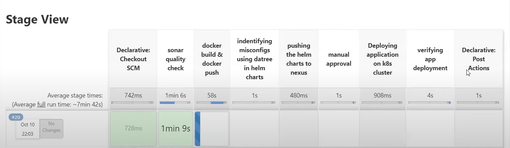

# Project Overview

## Description
This project is a custom CI/CD (Continuous Integration/Continuous Deployment) pipeline built with Jenkins. Its primary goal is to facilitate the automated building, testing, and deployment of Java applications. However, the pipeline's flexibility allows you to easily adapt it for hosting applications in various programming languages and frameworks by making minor configuration adjustments, including modifying build commands and base Docker images.



## Technologies Used
The project leverages a range of technologies to achieve its CI/CD objectives:

- **Jenkins**: The core of the CI/CD pipeline, responsible for automating various stages of software development, from code integration to deployment.

- **Docker**: Used for containerizing applications, allowing for consistent and portable deployments.

- **Kubernetes (kube adm)**: Provides orchestration for containerized applications, offering scalability and management capabilities.

- **SonarQube**: Ensures code quality and helps identify and fix code issues through static code analysis.

- **Helm**: A package manager for Kubernetes, enabling the definition, sharing, and deployment of applications on Kubernetes.

- **Datree**: Enhances code quality by enforcing best practices and policies during development.

- **Gradle**: A build automation tool used for building and managing Java projects.

- **Nexus**: A repository manager used for managing binary components and dependencies.

This README will guide you through setting up and customizing the CI/CD pipeline using these technologies, making it adaptable for your specific needs.

# Initial Setup

To get started with this project, you will need to set up a series of virtual machines (VMs) to host the required services. We recommend using a cloud provider of your choice to create and manage these VMs. Feel free to adapt the steps to your chosen cloud provider.

## VM Specifications
You will need to create five VMs, each with the following specifications:

- **Operating System**: Ubuntu (Base OS)
- **RAM**: 4 GB or 8 GB
- **Disk Space**: 20 GB

### VM Allocation
1. **Jenkins VM**: This VM will host Jenkins, the core of our CI/CD pipeline.
2. **Nexus Repository VM**: This VM will serve as a repository manager for binary components and dependencies.
3. **SonarQube VM**: SonarQube will run on this VM, ensuring code quality through static code analysis.
4. **Kubernetes Master Node VM**: Set up the Kubernetes master node on this VM to orchestrate containerized applications.
5. **Kubernetes Slave Node VM**: A Kubernetes slave node will be added to enhance the readiness and scalability of your Kubernetes cluster.

Feel free to adjust the number of VMs or their resources based on your project's requirements. If you believe certain tasks can be consolidated onto a single VM or need to scale your Kubernetes cluster, you can modify the setup accordingly.

## VM Setup Instructions
For detailed instructions on setting up the required software on each VM, refer to the `Vm-instructions.md` file provided in this project. The instructions in that file will guide you through the installation and configuration of Jenkins, Nexus Repository, SonarQube, and Kubernetes on their respective VMs.

Simply follow the steps and copy-paste the code snippets from `Vm-instructions.md` into your VMs to configure the software. This will get your infrastructure ready to host and manage your CI/CD pipeline effectively.

# Setting Up VMs

To prepare your infrastructure for the CI/CD pipeline, you will need to set up five virtual machines (VMs). Follow these instructions for each VM:

Checkout `Vm-instructions.md` all the code snippets are given there

## Jenkins VM

1. Install Java 11.
2. Install Jenkins.
3. Install Helm.
4. Install Datree as a Helm plugin (Refer to Datree's documentation).
5. Install Docker.

## SonarQube VM

1. Install Docker.
2. Run SonarQube as a Docker image (preferred for faster setup).

## Nexus Repository VM

1. Install Java 11.
2. Install Nexus.
3. Visit the Nexus web interface and create a Docker hosted repository and a Helm hosted repository with the same name as in the Jenkins configuration.

## Kubernetes Master and Slave Nodes

Both the Kubernetes master and slave nodes have similar installations:

1. Install kubeadm.
2. Follow the instructions in `Vm-instructions.md` for detailed steps on setting up your Kubernetes cluster. This will get your cluster up and running.

For detailed code snippets and further information, please refer to `Vm-instructions.md`.

# Adding Java Code to the Repository

 **Clone Your Repository:** First, make sure you have your repository cloned to your local machine using a tool like Git. If you haven't done that already, use the following command:

   ```shell
   git clone <repository_url>


```
# Setting up a Pipeline Job
1. **Create a New Pipeline Job**:

   - Log in to your Jenkins instance.
   - Click on "New Item" to create a new job.
   - Choose "Pipeline" as the job type and give it a name (e.g., MyGitHubPipeline).

2. **Configure GitHub SCM**:

   - In the job configuration, scroll down to the "Pipeline" section.
   - Choose "Pipeline script from SCM" as the definition.
   - Select "Git" as the SCM.
   - In the "Repository URL" field, enter the URL of your GitHub repository (e.g., `https://github.com/yourusername/your-repo.git`).

3. **Credential Configuration**:

   - In the "Credentials" section, click on the "Add" button to add your GitHub credentials.
   - Choose "Secret text" for the "Kind" field.
   - In the "Secret" field, enter your GitHub Personal Access Token or SSH Key.
   - Add a description for the credentials (e.g., "GitHub Personal Access Token").
   - Click "Add" to save the credentials.

 # Jenkins Plugins: Make sure the following Jenkins plugins are installed:

   - Docker Plugin: Required for Docker-related tasks.
   - Kubernetes CLI Plugin: Needed for Kubernetes operations.
   - Pipeline Plugin: Essential for defining and running pipelines.
   - SonarQube Scanner Plugin: Required for integrating with SonarQube.
   - Email Extension Plugin: Used for sending email notifications.
   - Credentials Binding Plugin: Needed for securely managing credentials.
   - Workspace Cleanup Plugin: For cleaning up workspace after the pipeline.

## Setting Up Jenkins Credentials

### Docker Credentials

1. Create a Docker Hub account if you don't have one.

2. Generate a Docker Hub access token with appropriate permissions.

3. In Jenkins, navigate to "Manage Jenkins" > "Manage Credentials."

4. Click on "(global)" domain or the appropriate domain for your use case.

5. Click "Add Credentials" and select "Secret text" as the kind.

6. Provide a unique ID (e.g., `docker_pass`) and paste your Docker Hub access token as the secret.

### Kubernetes Configuration

1. Ensure you have a valid Kubernetes configuration file (kubeconfig) for the target cluster.

2. In Jenkins, navigate to "Manage Jenkins" > "Manage Credentials."

3. Click on "(global)" domain or the appropriate domain for your use case.

4. Click "Add Credentials" and select "Kubernetes configuration (kubeconfig)" as the kind.

5. Provide a unique ID (e.g., `kubernetes-config`) and paste the content of your kubeconfig file into the "Kubeconfig" field.

### SonarQube Token

1. Obtain a valid SonarQube token for the SonarQube server.

2. In Jenkins, navigate to "Manage Jenkins" > "Manage Credentials."

3. Click on "(global)" domain or the appropriate domain for your use case.

4. Click "Add Credentials" and select "Secret text" as the kind.

5. Provide a unique ID (e.g., `sonar-token`) and paste your SonarQube token as the secret.

### Datree Token

1. Obtain an API token from Datree if you plan to use Datree for Helm chart validation.

2. In the Jenkins pipeline script, replace `DATREE_TOKEN` with your Datree API token.

## Pipeline Configuration

1. Copy the provided Jenkinsfile and create a new pipeline job in Jenkins.

2. Configure the job's settings as follows:

   - **Agent**: Set to `any` or adjust as per your Jenkins agent configuration.

   - **Build Environment**: Set environment variables as needed, such as `VERSION`.

3. Create a Jenkins project using the Jenkinsfile and configure the build triggers.

## Additional Considerations

- Ensure that you have a Nexus repository set up if you are pushing Helm charts to a Nexus repository, as specified in the pipeline.

- Adjust the Docker image, SonarQube, Kubernetes, and Datree configurations in the Jenkinsfile to match your specific environment and project requirements.If you change names make sure to do so in the jenkins file as well else stick with the names aleready provided

- Customize the email notification settings in the Jenkinsfile to specify recipients, sender, and other email-related details.

This setup is a starting point. Depending on your specific needs, you may need to make additional adjustments and install more Jenkins plugins or tools.

# Additional Configuration

To ensure a smooth pipeline execution, there are a couple of additional configuration steps that need to be completed:

## Docker Daemon Configuration

In order to allow the use of insecure Docker repositories, you need to modify the `daemon.json` file on all VMs where Docker is running. This file is typically located at `/etc/docker/daemon.json` or `/etc/default/docker`. Add the following configuration to allow Docker to connect to insecure registries:

```json
{
  "insecure-registries": ["<INSERT_INSECURE_REGISTRY_IP>:<INSERT_REGISTRY_PORT>"]
}

```
## Creating a Docker Registry Secret

To securely authenticate with a Docker registry, you can create a Kubernetes secret. This secret is particularly useful when working with private Docker registries like Nexus. Here are the steps to create the Docker registry secret:

1. Run the following `kubectl` command, replacing the placeholders with your specific information:

   ```bash
   kubectl create secret docker-registry registry-secret --docker-server=<NEXUS_MACHINE_IP>:8083 --docker-username=<YOUR_USERNAME> --docker-password=<YOUR_PASSWORD> --docker-email=not-needed@example.com
   ```

You are good to go , for each commit you can see the pipeline 

## Future Additions

We have exciting plans for the future of this project. Here are some of the upcoming features and improvements you can look forward to:

### Support for Any Framework or Programming Language

We're dedicated to enhancing the flexibility of this project. In the near future, you can expect small changes to the existing files that will enable you to deploy applications built with any framework or programming language. This means you'll have the freedom to choose the tools and technologies that best suit your project's requirements.

### Graphical User Interface (GUI)

One of our top priorities is to make hosting and deploying applications as user-friendly as possible. To achieve this, we are actively developing a graphical user interface (GUI). This GUI will simplify the entire process, making it even more accessible for users, whether you're a seasoned developer or just starting out.


